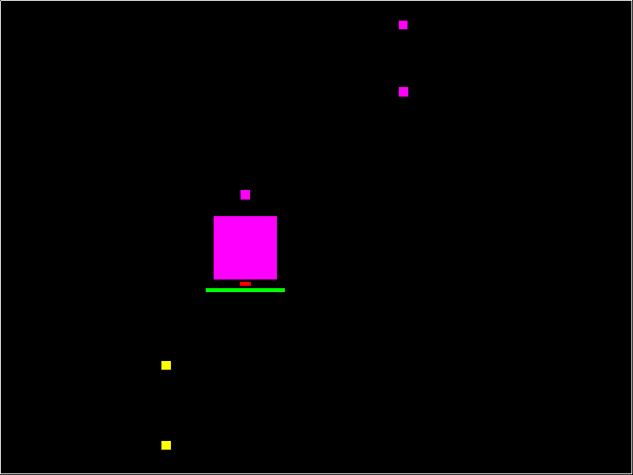

# dual

[](https://hackage.haskell.org/package/dual-game)

[](https://matrix.hackage.haskell.org/package/dual-game)

[](https://travis-ci.org/fgaz/dual)

A simplified clone of the "dual" game for Android.

## Requirements

You'll need the `freeglut` library. On ubuntu:

```
sudo apt-get install freeglut3-dev
```

## Installation

Install `ghc` and `cabal-install` and run:

```
cabal v2-install dual-game
```

## Usage

* start the server `dual <port>`
* start the client `dual <server ip> <port>`
* arrow keys to move, space to shoot (keep it pressed to charge a bigger projectile)
* the first one to lose all hp (the green bar) loses the game


